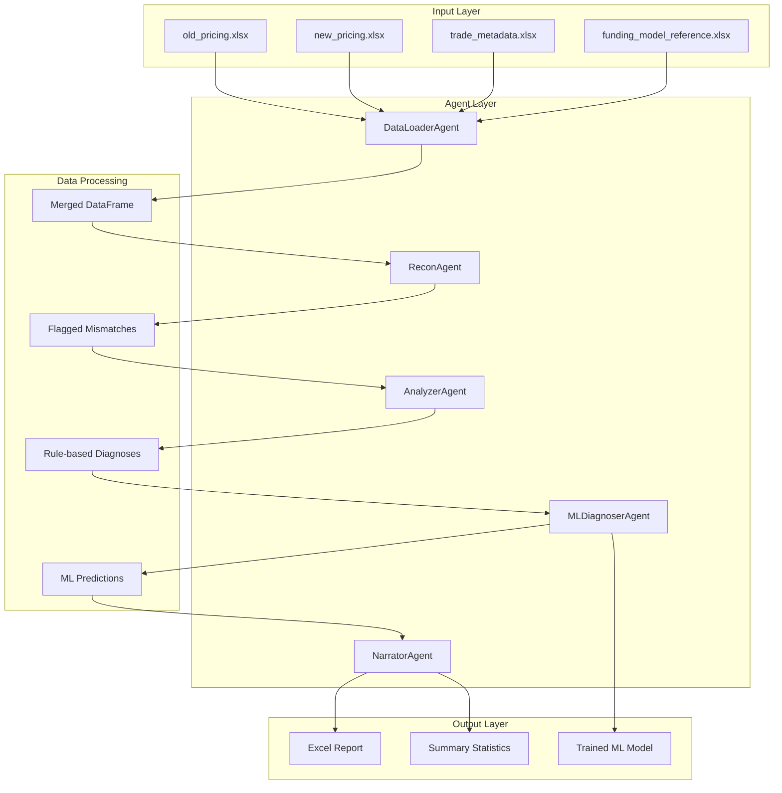

# 🏗️ System Architecture

## Overview

The AI-Powered Reconciliation System follows a modular, agent-based architecture inspired by CrewAI patterns. Each agent specializes in a specific task and communicates through structured data flows.

## System Architecture Diagram



## Data Flow Architecture

### Phase 1: Data Ingestion
```
┌─────────────┐  ┌─────────────┐  ┌─────────────┐
│ Excel Files │  │ DataLoader  │  │ Merged      │
│ (4 files)   │─▶│ Agent       │─▶│ DataFrame   │
└─────────────┘  └─────────────┘  └─────────────┘
```

### Phase 2: Mismatch Detection
```
┌─────────────┐  ┌─────────────┐  ┌─────────────┐
│ Merged      │  │ ReconAgent  │  │ Flagged     │
│ DataFrame   │─▶│ (Thresholds)│─▶│ Mismatches  │
└─────────────┘  └─────────────┘  └─────────────┘
```

### Phase 3: Analysis & Prediction
```
┌─────────────┐  ┌─────────────┐  ┌─────────────┐
│ Flagged     │  │ Analyzer    │  │ Rule-based  │
│ Data        │─▶│ Agent       │─▶│ Diagnoses   │
└─────────────┘  └─────────────┘  └─────────────┘
                        │
                        ▼
┌─────────────┐  ┌─────────────┐  ┌─────────────┐
│ Training    │  │ MLDiagnoser │  │ ML          │
│ Data        │─▶│ Agent       │─▶│ Predictions │
└─────────────┘  └─────────────┘  └─────────────┘
```

### Phase 4: Report Generation
```
┌─────────────┐  ┌─────────────┐  ┌─────────────┐
│ All Results │  │ Narrator    │  │ Excel       │
│ (Combined)  │─▶│ Agent       │─▶│ Report      │
└─────────────┘  └─────────────┘  └─────────────┘
```

## Agent Architecture Details

### DataLoaderAgent
**Purpose**: Data ingestion and preprocessing
**Input**: Multiple Excel files
**Output**: Single merged DataFrame
**Key Methods**:
- `load_all_data()`: Merges all input files on TradeID

### ReconAgent
**Purpose**: Mismatch detection using configurable thresholds
**Input**: Merged DataFrame
**Output**: DataFrame with mismatch flags
**Key Methods**:
- `add_diff_flags(df)`: Adds PV_Mismatch, Delta_Mismatch flags
**Configuration**:
- `pv_tolerance = 1000`
- `delta_tolerance = 0.05`

### AnalyzerAgent
**Purpose**: Rule-based root cause analysis
**Input**: Flagged DataFrame
**Output**: DataFrame with business diagnoses
**Key Methods**:
- `rule_based_diagnosis(row)`: Applies business rules
- `apply(df)`: Processes entire DataFrame

### MLDiagnoserAgent
**Purpose**: Machine learning-based diagnosis prediction
**Input**: Training data (rule-based diagnoses as labels)
**Output**: ML predictions and trained model
**Key Methods**:
- `train(df)`: Trains CatBoost model
- `predict(df)`: Generates ML predictions
- `save_model()`: Persists trained model
- `load_model()`: Loads existing model

### NarratorAgent
**Purpose**: Report generation and summarization
**Input**: Complete DataFrame with all analyses
**Output**: Excel report and summary statistics
**Key Methods**:
- `summarize_report(df)`: Generates summary statistics
- `save_report(df)`: Creates Excel output file

## ML Model Architecture

### Feature Engineering Pipeline

```
┌─────────────────────────────────────────────────────────────┐
│                    Feature Engineering                      │
├─────────────────────────────────────────────────────────────┤
│ Numerical Features:                                        │
│ • PV_old, PV_new (Present Values)                         │
│ • Delta_old, Delta_new (Risk Measures)                    │
│                                                           │
│ Categorical Features:                                      │
│ • ProductType (Swap, Option, etc.)                        │
│ • FundingCurve (USD-LIBOR, SOFR, etc.)                    │
│ • CSA_Type (Cleared_CSA, Bilateral, etc.)                 │
│ • ModelVersion (v2024.3, v2024.2, etc.)                   │
└─────────────────────────────────────────────────────────────┘
```

### Model Training Process

```
┌─────────────────────────────────────────────────────────────┐
│                    Model Training                          │
├─────────────────────────────────────────────────────────────┤
│ 1. Feature Preparation                                     │
│    • Select relevant columns                              │
│    • Handle missing values                                │
│    • Encode categorical features                          │
│                                                           │
│ 2. Label Preparation                                      │
│    • Use rule-based diagnoses as labels                  │
│    • Encode labels using LabelEncoder                     │
│                                                           │
│ 3. Model Training                                         │
│    • Initialize CatBoostClassifier                        │
│    • Specify categorical feature indices                  │
│    • Fit model to training data                           │
│                                                           │
│ 4. Model Persistence                                      │
│    • Save model and label encoder                         │
│    • Store in models/ directory                           │
└─────────────────────────────────────────────────────────────┘
```

### Prediction Pipeline

```
┌─────────────────────────────────────────────────────────────┐
│                    Prediction Pipeline                     │
├─────────────────────────────────────────────────────────────┤
│ 1. Model Loading                                          │
│    • Load trained CatBoost model                          │
│    • Load label encoder                                   │
│                                                           │
│ 2. Feature Preparation                                    │
│    • Apply same preprocessing as training                 │
│    • Handle new categorical values                        │
│                                                           │
│ 3. Prediction Generation                                  │
│    • Generate raw predictions                             │
│    • Decode using label encoder                          │
│                                                           │
│ 4. Result Integration                                     │
│    • Add ML_Diagnosis column to DataFrame                │
│    • Compare with rule-based diagnoses                   │
└─────────────────────────────────────────────────────────────┘
```

## Data Schema

### Input Data Schema

**old_pricing.xlsx**
| Column | Type | Description |
|--------|------|-------------|
| TradeID | String | Unique trade identifier |
| PV_old | Float | Present value (old model) |
| Delta_old | Float | Delta risk (old model) |

**new_pricing.xlsx**
| Column | Type | Description |
|--------|------|-------------|
| TradeID | String | Unique trade identifier |
| PV_new | Float | Present value (new model) |
| Delta_new | Float | Delta risk (new model) |

**trade_metadata.xlsx**
| Column | Type | Description |
|--------|------|-------------|
| TradeID | String | Unique trade identifier |
| ProductType | String | Financial product type |
| FundingCurve | String | Funding curve identifier |
| CSA_Type | String | Credit Support Annex type |
| ModelVersion | String | Model version identifier |

**funding_model_reference.xlsx**
| Column | Type | Description |
|--------|------|-------------|
| TradeID | String | Unique trade identifier |
| Additional funding-related fields | Various | Funding model parameters |

### Output Data Schema

**final_recon_report.xlsx**
| Column | Type | Description |
|--------|------|-------------|
| TradeID | String | Unique trade identifier |
| PV_old, PV_new | Float | Present values |
| Delta_old, Delta_new | Float | Delta risk measures |
| PV_Diff, Delta_Diff | Float | Differences |
| PV_Mismatch, Delta_Mismatch | Boolean | Mismatch flags |
| ProductType, FundingCurve, CSA_Type, ModelVersion | String | Trade characteristics |
| Diagnosis | String | Rule-based diagnosis |
| ML_Diagnosis | String | ML-based diagnosis |

## Performance Characteristics

### Processing Performance
- **Data Loading**: ~1000 trades/second
- **Mismatch Detection**: ~5000 trades/second
- **Rule-based Analysis**: ~2000 trades/second
- **ML Training**: ~1-5 seconds (depending on data size)
- **ML Prediction**: ~10000 trades/second

### Memory Usage
- **Peak Memory**: ~2x data size (for merged DataFrame)
- **Model Size**: ~1MB (CatBoost model)
- **Report Size**: ~data size + analysis columns

### Scalability
- **Linear Scaling**: Performance scales linearly with data size
- **Memory Efficient**: Processes data in chunks if needed
- **Model Persistence**: Trained model can be reused

## Security Considerations

### Data Security
- **Local Processing**: All data processed locally
- **No External APIs**: No data sent to external services
- **File-based I/O**: Uses standard file operations

### Model Security
- **Model Validation**: Ensures model integrity before loading
- **Version Control**: Model versioning for reproducibility
- **Backup Strategy**: Model backups for disaster recovery

## Error Handling

### Data Validation
- **Missing Values**: Handled gracefully with appropriate defaults
- **Data Type Validation**: Ensures correct data types
- **Schema Validation**: Validates input file structure

### Model Robustness
- **Feature Validation**: Ensures required features are present
- **Prediction Confidence**: Can add confidence scores
- **Fallback Mechanisms**: Rule-based fallback if ML fails

## Monitoring and Logging

### System Monitoring
- **Progress Tracking**: Step-by-step progress indicators
- **Performance Metrics**: Processing time and throughput
- **Error Reporting**: Detailed error messages and stack traces

### Quality Assurance
- **Data Quality Checks**: Validates input data quality
- **Model Performance**: Tracks prediction accuracy
- **Result Validation**: Ensures output consistency

## Deployment Architecture

### Local Deployment
```
┌─────────────────────────────────────────────────────────────┐
│                    Local Environment                       │
├─────────────────────────────────────────────────────────────┤
│ • Python 3.8+                                             │
│ • Required packages (see requirements.txt)                │
│ • Input data files in data/ directory                     │
│ • Output reports in project root                          │
│ • Trained models in models/ directory                     │
└─────────────────────────────────────────────────────────────┘
```

### Production Considerations
- **Containerization**: Docker for consistent environments
- **Resource Management**: Memory and CPU optimization
- **Logging**: Structured logging for monitoring
- **Error Handling**: Robust error handling and recovery
- **Performance Tuning**: Optimize for production workloads

## Future Architecture Enhancements

### Microservices Architecture
```
┌─────────────┐  ┌─────────────┐  ┌─────────────┐
│ Data        │  │ Processing  │  │ ML          │
│ Service     │  │ Service     │  │ Service     │
└─────────────┘  └─────────────┘  └─────────────┘
       │                │                │
       └────────────────┼────────────────┘
                        │
                ┌─────────────┐
                │ API Gateway │
                └─────────────┘
```

### Real-time Processing
- **Stream Processing**: Apache Kafka for real-time data
- **Event-driven Architecture**: React to data changes
- **Caching Layer**: Redis for performance optimization

### Cloud Deployment
- **AWS/GCP/Azure**: Cloud-native deployment
- **Auto-scaling**: Handle variable workloads
- **Managed Services**: Use cloud ML services 