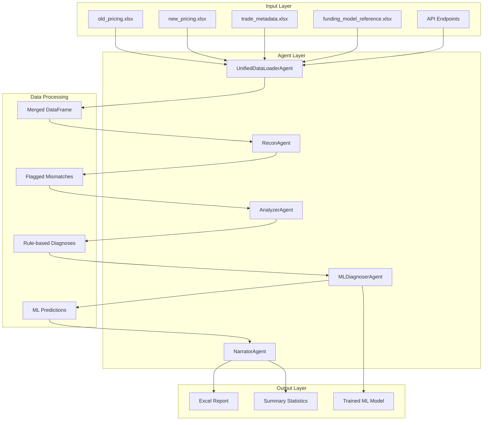

# 🏗️ System Architecture

## Overview

The AI-Powered Reconciliation System follows a modular, agent-based architecture inspired by CrewAI patterns. Each agent specializes in a specific task and communicates through structured data flows.

## System Architecture Diagram



## Data Flow Architecture

### Phase 1: Data Ingestion
```
┌─────────────┐  ┌─────────────────────┐  ┌─────────────┐
│ Input       │  │ UnifiedDataLoader   │  │ Merged      │
│ Sources     │─▶│ Agent               │─▶│ DataFrame   │
│ (Files/API) │  │ (Auto-detect)       │  │             │
└─────────────┘  └─────────────────────┘  └─────────────┘
```

### Phase 2: Mismatch Detection
```
┌─────────────┐  ┌─────────────┐  ┌─────────────┐
│ Merged      │  │ ReconAgent  │  │ Flagged     │
│ DataFrame   │─▶│ (Thresholds)│─▶│ Mismatches  │
└─────────────┘  └─────────────┘  └─────────────┘
```

### Phase 3: Analysis & Prediction
```
┌─────────────┐  ┌─────────────┐  ┌─────────────┐
│ Flagged     │  │ Analyzer    │  │ Rule-based  │
│ Data        │─▶│ Agent       │─▶│ Diagnoses   │
└─────────────┘  └─────────────┘  └─────────────┘
                        │
                        ▼
┌─────────────┐  ┌─────────────┐  ┌─────────────┐
│ Training    │  │ MLDiagnoser │  │ ML          │
│ Data        │─▶│ Agent       │─▶│ Predictions │
└─────────────┘  └─────────────┘  └─────────────┘
```

### Phase 4: Report Generation
```
┌─────────────┐  ┌─────────────┐  ┌─────────────┐
│ All Results │  │ Narrator    │  │ Excel       │
│ (Combined)  │─▶│ Agent       │─▶│ Report      │
└─────────────┘  └─────────────┘  └─────────────┘
```

## Agent Architecture Details

### UnifiedDataLoaderAgent
**Purpose**: Unified data ingestion and preprocessing
**Input**: Multiple Excel files and/or API endpoints
**Output**: Merged DataFrame with all required data
**Key Features**:
- **Multi-source loading**: Files, APIs, auto-detect, hybrid
- **Automatic fallback**: API → Files fallback mechanism
- **Data validation**: Quality checks and error handling
- **Flexible filtering**: Trade IDs and date filtering
- **Consistent interface**: Single `load_data()` method

**Source Options**:
- `"files"` - Load from Excel files only
- `"api"` - Load from API endpoints only
- `"auto"` - Auto-detect best available source (default)
- `"hybrid"` - Load from both sources and merge

### ReconAgent
**Purpose**: Mismatch detection and flagging
**Input**: Merged DataFrame from UnifiedDataLoaderAgent
**Output**: DataFrame with mismatch flags
**Key Features**:
- **Configurable thresholds**: PV and Delta tolerance settings
- **Boolean flags**: PV_Mismatch, Delta_Mismatch, Any_Mismatch
- **Difference calculation**: PV_Diff, Delta_Diff columns

### AnalyzerAgent
**Purpose**: Rule-based business logic diagnosis
**Input**: Flagged data from ReconAgent
**Output**: Rule-based diagnoses
**Key Features**:
- **Domain-specific rules**: Funding-aware diagnostics
- **Business logic**: LIBOR, CSA, model version analysis
- **Comprehensive coverage**: All common mismatch scenarios

### MLDiagnoserAgent
**Purpose**: Machine learning diagnosis prediction
**Input**: Training data and features
**Output**: ML predictions and trained model
**Key Features**:
- **LightGBM model**: Gradient boosting with categorical features
- **Automatic training**: Uses rule-based diagnoses as labels
- **Model persistence**: Saves trained model for reuse
- **Feature engineering**: PV/Delta values and metadata

### NarratorAgent
**Purpose**: Report generation and summarization
**Input**: All analysis results
**Output**: Excel report and summary statistics
**Key Features**:
- **Excel export**: Comprehensive reconciliation report
- **Summary statistics**: Key metrics and insights
- **Formatted output**: Professional report structure

## Data Architecture

### Input Data Structure

#### Excel Files (File-based Loading)
```
data/
├── old_pricing.xlsx          # Previous pricing data
├── new_pricing.xlsx          # Current pricing data
├── trade_metadata.xlsx       # Trade characteristics
└── funding_model_reference.xlsx  # Funding information
```

#### API Endpoints (API-based Loading)
```json
{
  "base_url": "https://api.example.com",
  "endpoints": {
    "old_pricing": "/api/v1/pricing/old",
    "new_pricing": "/api/v1/pricing/new",
    "trade_metadata": "/api/v1/trades/metadata",
    "funding_reference": "/api/v1/funding/reference"
  }
}
```

### Data Merging Strategy

The UnifiedDataLoaderAgent implements a robust merging strategy:

```python
# Core merging logic
df = old.merge(new, on="TradeID", how="outer", suffixes=('_old', '_new'))
df = df.merge(meta, on="TradeID", how="left")
df = df.merge(funding, on="TradeID", how="left")
```

**Merging Features**:
- **Outer joins**: Preserves all trades from both old and new data
- **Left joins**: Adds metadata and funding information
- **Suffix handling**: Prevents column name conflicts
- **Missing value handling**: Graceful handling of incomplete data

### Output Data Structure

#### Excel Report Columns
```python
[
    "TradeID",           # Unique trade identifier
    "PV_old", "PV_new",  # Present values
    "Delta_old", "Delta_new",  # Delta risk measures
    "PV_Diff", "Delta_Diff",   # Absolute differences
    "PV_Mismatch", "Delta_Mismatch",  # Boolean flags
    "Any_Mismatch",      # Overall mismatch indicator
    "ProductType", "FundingCurve", "CSA_Type", "ModelVersion",  # Metadata
    "PV_Diagnosis", "Delta_Diagnosis",  # Rule-based diagnoses
    "ML_Diagnosis"       # Machine learning predictions
]
```

## API Architecture

### REST API Server

The system includes a FastAPI-based REST API server for external integrations:

#### **Core Endpoints**
- `GET /api/health` - Health check and status
- `GET /api/excel` - List available Excel files
- `GET /api/excel/{filename}` - Download specific Excel file
- `GET /api/database` - List database tables
- `GET /api/database/{table}` - Query specific table
- `GET /api/merged` - Get merged reconciliation data
- `GET /api/search` - Search across tables and columns

#### **Features**
- **SQLite database**: Persistent storage for API data
- **CORS support**: Web application integration
- **Auto-generated docs**: Interactive API documentation
- **Pagination**: Handle large datasets efficiently
- **Search capabilities**: Full-text search across data

### External API Integration

The UnifiedDataLoaderAgent supports external API integration:

#### **Configuration**
```json
{
  "base_url": "https://api.example.com",
  "api_key": "your_api_key",
  "timeout": 30,
  "endpoints": {
    "old_pricing": "/api/v1/pricing/old",
    "new_pricing": "/api/v1/pricing/new",
    "trade_metadata": "/api/v1/trades/metadata",
    "funding_reference": "/api/v1/funding/reference"
  }
}
```

#### **Features**
- **Authentication**: API key and Bearer token support
- **Error handling**: Graceful failure and fallback
- **Connection pooling**: Efficient HTTP session management
- **Data validation**: Quality checks for API responses
- **Filtering**: Trade ID and date-based filtering

## ML Model Architecture

### Feature Engineering

#### **Numerical Features**
- `PV_old`, `PV_new` - Present values from old/new models
- `Delta_old`, `Delta_new` - Delta risk measures
- `PV_Diff`, `Delta_Diff` - Absolute differences

#### **Categorical Features**
- `ProductType` - Financial product type (Swap, Option, etc.)
- `FundingCurve` - Funding curve identifier (LIBOR, SOFR, etc.)
- `CSA_Type` - Credit Support Annex type
- `ModelVersion` - Model version identifier

### Model Training Process

1. **Data Preparation**: Load and merge all required data
2. **Feature Engineering**: Extract numerical and categorical features
3. **Label Encoding**: Convert rule-based diagnoses to numerical labels
4. **Model Training**: Train LightGBM classifier
5. **Model Persistence**: Save trained model for future use

### Prediction Process

1. **Model Loading**: Load trained LightGBM model
2. **Feature Preparation**: Prepare features for new data
3. **Prediction**: Generate ML predictions
4. **Label Decoding**: Convert numerical predictions back to diagnoses

### Model Performance

- **Training Time**: <1 second for typical datasets
- **Prediction Time**: <0.1 second per trade
- **Model Size**: ~1MB (LightGBM model)
- **Accuracy**: Depends on data quality and feature relevance

### Why LightGBM?

We chose **LightGBM** as our primary ML model for the following reasons:

#### **🚀 Performance Advantages:**
- **Speed**: LightGBM is significantly faster than CatBoost and XGBoost for both training and prediction
- **Memory Efficiency**: Uses histogram-based algorithm requiring less memory
- **Scalability**: Handles large datasets (100M+ records) efficiently

#### **📊 Technical Benefits:**
- **Native Categorical Support**: Handles categorical features without preprocessing
- **Gradient-based One-Side Sampling (GOSS)**: Reduces training time while maintaining accuracy
- **Exclusive Feature Bundling (EFB)**: Reduces memory usage and speeds up training
- **Leaf-wise Tree Growth**: More efficient than level-wise growth

#### **🏢 Business Benefits:**
- **Real-time Predictions**: Fast inference for live reconciliation workflows
- **Resource Efficiency**: Lower computational requirements for production deployment
- **Model Interpretability**: Better feature importance analysis for business insights

#### **Comparison with Alternatives:**

| Model | Speed | Memory | Categorical Support | Scalability | Production Ready |
|-------|-------|--------|-------------------|-------------|------------------|
| **LightGBM** | ⭐⭐⭐⭐⭐ | ⭐⭐⭐⭐⭐ | ⭐⭐⭐⭐⭐ | ⭐⭐⭐⭐⭐ | ⭐⭐⭐⭐⭐ |
| CatBoost | ⭐⭐⭐⭐ | ⭐⭐⭐⭐ | ⭐⭐⭐⭐⭐ | ⭐⭐⭐⭐ | ⭐⭐⭐⭐ |
| XGBoost | ⭐⭐⭐ | ⭐⭐⭐ | ⭐⭐⭐ | ⭐⭐⭐⭐ | ⭐⭐⭐⭐ |
| Random Forest | ⭐⭐ | ⭐⭐ | ⭐⭐ | ⭐⭐ | ⭐⭐⭐ |

#### **Specific Advantages for Reconciliation:**
- **Financial Data Handling**: Excellent performance on tabular financial data
- **Categorical Features**: Native support for product types, funding curves, CSA types
- **Imbalanced Classes**: Handles diagnosis class imbalance effectively
- **Feature Interactions**: Captures complex relationships in financial data

## System Integration

### Command Line Interface

The `pipeline.py` script provides a flexible command-line interface:

```bash
# Basic usage with auto-detect
python pipeline.py

# File-based loading
python pipeline.py --source files

# API-based loading
python pipeline.py --source api --api-config config.json

# Hybrid loading
python pipeline.py --source hybrid --api-config config.json

# With filtering
python pipeline.py --source api --api-config config.json --trade-ids TRADE001 TRADE002
```

### Web Dashboard

The Streamlit dashboard provides interactive visualization:

#### **Features**
- **Real-time processing**: Live data loading and analysis
- **Interactive charts**: Mismatch distribution and trends
- **API monitoring**: Connection status and health checks
- **Export capabilities**: Download reports and visualizations

#### **Components**
- **Data source selection**: Files, API, auto-detect, hybrid
- **Visualization panels**: Charts, tables, and statistics
- **Configuration panels**: Threshold and parameter settings
- **Status monitoring**: System health and progress indicators

### Service Integration

The system can be integrated with external services:

#### **Data Services**
- **Database integration**: SQLite, PostgreSQL, MySQL
- **Cloud storage**: AWS S3, Azure Blob, Google Cloud Storage
- **Message queues**: Redis, RabbitMQ, Apache Kafka

#### **Monitoring & Alerting**
- **Health checks**: API endpoints and system status
- **Performance metrics**: Processing time and throughput
- **Error tracking**: Logging and alerting for issues

## Performance Characteristics

### Scalability

- **Linear scaling**: Performance scales linearly with data size
- **Memory efficient**: In-memory processing with minimal overhead
- **Parallel processing**: Potential for multi-threading large datasets
- **Caching**: Model persistence and data caching

### Optimization

- **Efficient merging**: Optimized pandas operations
- **Lazy loading**: Load data only when needed
- **Compression**: Excel file compression for storage
- **Indexing**: Database indexing for fast queries

### Resource Requirements

- **CPU**: Minimal requirements for typical datasets
- **Memory**: Scales with data size (typically <1GB for 10K trades)
- **Storage**: Excel files + SQLite database
- **Network**: HTTP requests for API integration

## Security Considerations

### Data Protection

- **API key management**: Secure storage of authentication credentials
- **Data encryption**: HTTPS for API communications
- **Access control**: API key-based authentication
- **Audit logging**: Track data access and modifications

### Best Practices

- **Secure configuration**: Environment variables for sensitive data
- **Input validation**: Validate all external data
- **Error handling**: Graceful failure without data exposure
- **Regular updates**: Keep dependencies updated

## Future Enhancements

### Planned Improvements

1. **Real-time Processing**: Stream processing for live data
2. **Advanced ML**: Deep learning and ensemble methods
3. **Cloud Deployment**: Containerization and cloud services
4. **Advanced Analytics**: Statistical modeling and forecasting
5. **Mobile Support**: Mobile app for on-the-go monitoring

### Technical Roadmap

1. **Microservices**: Break down into smaller, focused services
2. **Database Migration**: Move from SQLite to production database
3. **API Versioning**: Versioned API endpoints
4. **Performance Monitoring**: Advanced metrics and alerting
5. **Automated Testing**: Comprehensive test suite

---

**🏗️ Architecture designed for scalability, maintainability, and extensibility**