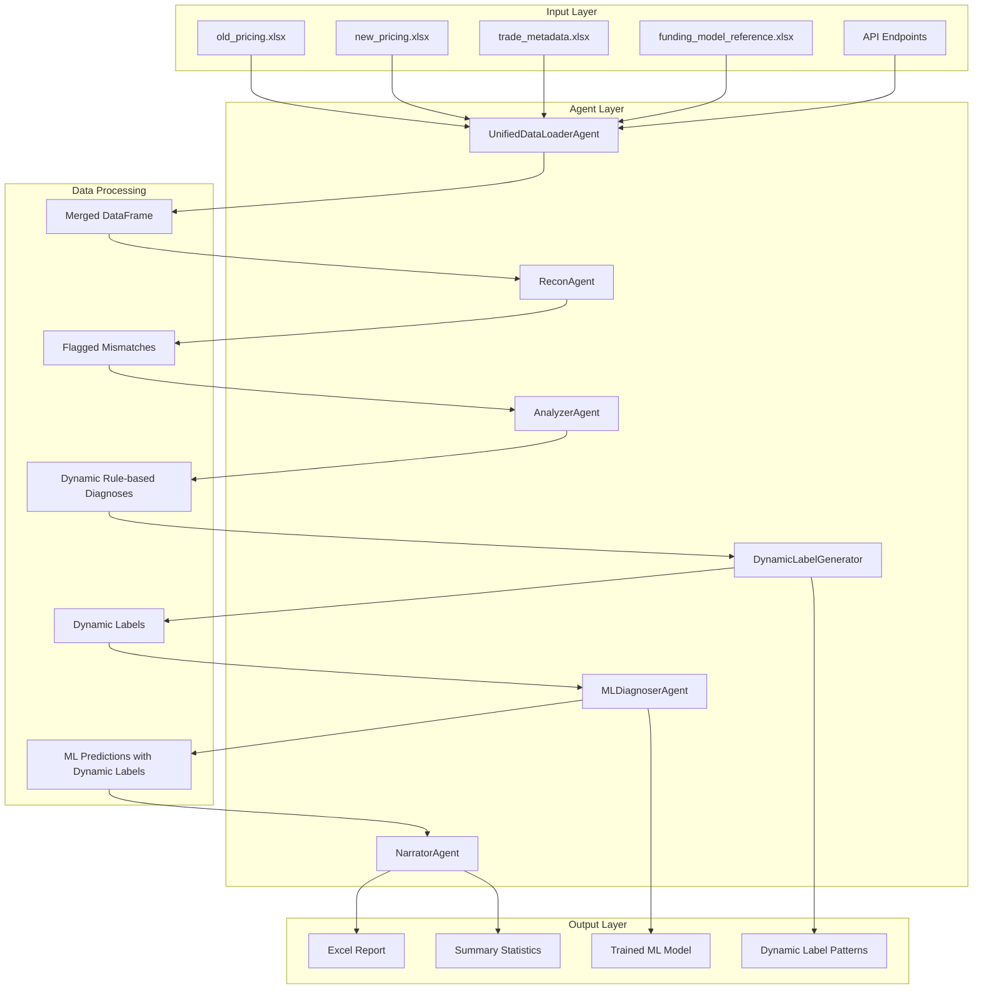
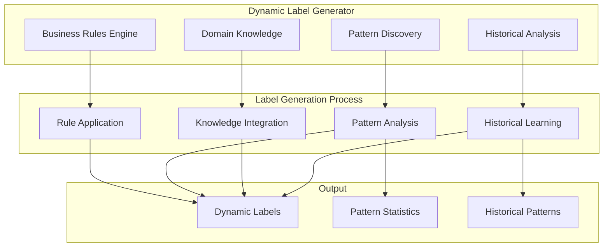
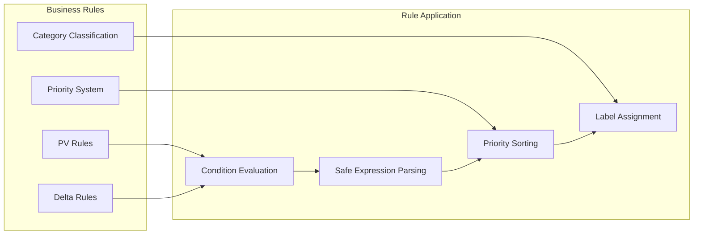

# 🏗️ System Architecture

## Overview

The AI-Powered Reconciliation System follows a modular, agent-based architecture inspired by CrewAI patterns. Each agent specializes in a specific task and communicates through structured data flows, featuring **dynamic label generation** for real-time diagnosis scenarios.

## System Architecture Diagram



## Dynamic Label Generation Architecture

### Core Components



### Business Rules Engine



## Data Flow Architecture

### Phase 1: Data Ingestion
```
┌─────────────┐  ┌─────────────────────┐  ┌─────────────┐
│ Input       │  │ UnifiedDataLoader   │  │ Merged      │
│ Sources     │─▶│ Agent               │─▶│ DataFrame   │
│ (Files/API) │  │ (Auto-detect)       │  │             │
│ Auto-Load   │  │ (Auto-Load)         │  │             │
└─────────────┘  └─────────────────────┘  └─────────────┘
```

### Phase 2: Mismatch Detection
```
┌─────────────┐  ┌─────────────┐  ┌─────────────┐
│ Merged      │  │ ReconAgent  │  │ Flagged     │
│ DataFrame   │─▶│ (Thresholds)│─▶│ Mismatches  │
└─────────────┘  └─────────────┘  └─────────────┘
```

### Phase 3: Dynamic Analysis & Prediction
```
┌─────────────┐  ┌─────────────┐  ┌─────────────┐
│ Flagged     │  │ Analyzer    │  │ Dynamic     │
│ Data        │─▶│ Agent       │─▶│ Rule-based  │
│             │  │ (Dynamic    │  │ Diagnoses   │
│             │  │  Rules)     │  │             │
└─────────────┘  └─────────────┘  └─────────────┘
                        │
                        ▼
┌─────────────┐  ┌─────────────┐  ┌─────────────┐
│ Dynamic     │  │ Dynamic     │  │ Dynamic     │
│ Diagnoses   │─▶│ Label       │─▶│ Labels      │
│             │  │ Generator   │  │             │
└─────────────┘  └─────────────┘  └─────────────┘
                        │
                        ▼
┌─────────────┐  ┌─────────────┐  ┌─────────────┐
│ Dynamic     │  │ MLDiagnoser │  │ ML          │
│ Labels      │─▶│ Agent       │─▶│ Predictions │
│             │  │ (with       │  │ with        │
│             │  │  Dynamic    │  │  Dynamic    │
│             │  │  Labels)    │  │  Labels      │
└─────────────┘  └─────────────┘  └─────────────┘
```

### Phase 4: Report Generation
```
┌─────────────┐  ┌─────────────┐  ┌─────────────┐
│ All Results │  │ Narrator    │  │ Excel       │
│ (Combined)  │─▶│ Agent       │─▶│ Report      │
│ with Dynamic│  │             │  │ with        │
│ Labels      │  │             │  │ Dynamic     │
│             │  │             │  │ Labels      │
└─────────────┘  └─────────────┘  └─────────────┘
```

## Agent Architecture Details

### UnifiedDataLoaderAgent

**Purpose**: Loads and merges data from multiple sources with auto-load functionality.

**Key Features**:
- **Multi-source Support**: Files, APIs, Auto-detect, Hybrid
- **Auto-load Functionality**: Automatic loading from data/ directory
- **Data Validation**: Ensures data quality and completeness
- **Error Handling**: Graceful handling of missing or corrupted files

**Data Flow**:
```
Input Files/APIs → Data Validation → Merging → Output DataFrame
```

### ReconAgent

**Purpose**: Detects PV and Delta mismatches using configurable thresholds.

**Key Features**:
- **Configurable Thresholds**: PV and Delta tolerance settings
- **Boolean Flagging**: Clear mismatch identification
- **Performance Optimization**: Efficient processing for large datasets

**Data Flow**:
```
Merged DataFrame → Threshold Comparison → Mismatch Flags → Output
```

### AnalyzerAgent (Enhanced)

**Purpose**: Provides **dynamic rule-based diagnosis** using configurable business rules.

**Key Features**:
- **Dynamic Business Rules**: Configurable rules for diagnosis generation
- **Safe Condition Evaluation**: Safely evaluates string-based conditions
- **Rule Management**: Add, modify, and manage business rules
- **Integration**: Updates the label generator with analysis results

**Components**:
- **PVAnalysisAgent**: Analyzes PV-related issues using dynamic rules
- **DeltaAnalysisAgent**: Analyzes Delta-related issues using dynamic rules
- **Rule Engine**: Applies business rules with priority sorting

**Data Flow**:
```
Flagged Data → Business Rules → Condition Evaluation → Dynamic Diagnoses
```

### DynamicLabelGenerator (New)

**Purpose**: Generates diagnosis labels in real-time based on business rules, patterns, and domain knowledge.

**Key Features**:
- **Business Rules Engine**: Loads and applies configurable business rules
- **Pattern Discovery**: Analyzes data to identify new diagnosis patterns
- **Domain Knowledge**: Industry-specific diagnosis categories
- **Historical Tracking**: Maintains patterns and label frequency
- **Real-time Updates**: Updates based on analysis results

**Components**:
- **Business Rules Engine**: Applies configurable rules with priority
- **Pattern Discovery**: Identifies PV, Delta, temporal, and product patterns
- **Domain Knowledge**: Industry-specific diagnosis categories
- **Historical Analysis**: Tracks pattern frequency and trends

**Data Flow**:
```
Analysis Results → Business Rules → Pattern Discovery → Domain Knowledge → Dynamic Labels
```

### MLDiagnoserAgent (Enhanced)

**Purpose**: ML-powered diagnosis predictions using **dynamically generated labels**.

**Key Features**:
- **Dynamic Label Integration**: Uses dynamically generated labels for training
- **Adaptive Training**: Model adapts to new patterns and rules
- **Real-time Learning**: Incorporates new diagnoses automatically
- **LightGBM Model**: Fast and efficient gradient boosting

**Data Flow**:
```
Training Data → Dynamic Labels → Feature Engineering → Model Training → Predictions
```

### NarratorAgent

**Purpose**: Generates comprehensive reports and summaries.

**Key Features**:
- **Excel Report Generation**: Complete reconciliation reports
- **Summary Statistics**: Key metrics and insights
- **Dynamic Label Integration**: Includes dynamic labels in reports

**Data Flow**:
```
All Results → Report Generation → Excel Output → Summary Statistics
```

## Dynamic Label Generation Process

### 1. Business Rules Application

```python
# Example business rule application
business_rules = {
    "pv_rules": [
        {
            "condition": "PV_old is None",
            "label": "New trade – no prior valuation",
            "priority": 1,
            "category": "trade_lifecycle"
        },
        {
            "condition": "FundingCurve == 'USD-LIBOR' and ModelVersion != 'v2024.3'",
            "label": "Legacy LIBOR curve with outdated model – PV likely shifted",
            "priority": 2,
            "category": "curve_model"
        }
    ]
}
```

### 2. Pattern Discovery

The system automatically discovers patterns in the data:

- **PV Patterns**: Analyzes PV differences and trends
- **Delta Patterns**: Identifies delta sensitivity patterns
- **Temporal Patterns**: Time-based analysis and seasonality
- **Product Patterns**: Product-specific diagnosis patterns

### 3. Domain Knowledge Integration

Comprehensive domain knowledge categories:

- **Trade Lifecycle**: New trades, dropped trades, amendments
- **Curve/Model**: LIBOR transition, model updates, curve changes
- **Funding/CSA**: Clearing changes, collateral updates, margin requirements
- **Volatility**: Option sensitivity, delta impacts, model shifts
- **Data Quality**: Missing data, validation issues, format problems
- **Market Events**: Market disruptions, regulatory changes

### 4. Historical Learning

The system learns from previous analyses:

- **Pattern Frequency**: Tracks how often patterns occur
- **Label Statistics**: Maintains label usage statistics
- **Trend Analysis**: Identifies emerging patterns and trends

## Business Rules Categories

### Trade Lifecycle
- New trade – no prior valuation
- Trade dropped from new model
- Trade amended with new terms
- Trade matured or expired

### Curve/Model
- Legacy LIBOR curve with outdated model
- SOFR transition impact – curve basis changed
- Model version update – methodology changed
- Curve interpolation changed – end points affected

### Funding/CSA
- CSA changed post-clearing – funding basis moved
- Collateral threshold changed – funding cost shifted
- New clearing house – margin requirements different
- Bilateral to cleared transition – funding curve changed

### Volatility
- Vol sensitivity likely – delta impact due to model curve shift
- Option pricing model update – volatility surface changed
- Market volatility spike – delta hedging impact
- Volatility smile adjustment – skew changes

### Data Quality
- Missing pricing data – incomplete valuation
- Data format mismatch – parsing errors
- Validation failures – business rule violations
- Timestamp inconsistencies – temporal misalignment

### Market Events
- Market disruption – liquidity impact
- Regulatory change – compliance requirements
- Central bank action – rate environment shift
- Credit event – counterparty risk change

## Configuration Management

### Business Rules Configuration

```python
# Configure business rules for diagnosis generation
business_rules = {
    "pv_rules": [
        {
            "condition": "PV_old is None",
            "label": "New trade – no prior valuation",
            "priority": 1,
            "category": "trade_lifecycle"
        },
        {
            "condition": "FundingCurve == 'USD-LIBOR' and ModelVersion != 'v2024.3'",
            "label": "Legacy LIBOR curve with outdated model",
            "priority": 2,
            "category": "curve_model"
        }
    ],
    "delta_rules": [
        {
            "condition": "ProductType == 'Option' and Delta_Mismatch == True",
            "label": "Vol sensitivity likely – delta impact",
            "priority": 2,
            "category": "volatility"
        }
    ]
}
```

### Pattern Discovery Configuration

```python
# Configure pattern discovery parameters
pattern_config = {
    "pv_threshold": 0.1,
    "delta_threshold": 0.05,
    "temporal_window": 30,
    "product_specific": True,
    "historical_weight": 0.3
}
```

## Performance Characteristics

### Processing Capabilities
- **Data Loading**: 1,000-10,000 trades/second (file-based)
- **ML Training**: 10,000-100,000 trades/second (LightGBM)
- **ML Prediction**: 50,000-500,000 trades/second (optimized)
- **Report Generation**: 1,000-10,000 trades/second
- **Dynamic Label Generation**: Real-time pattern discovery and rule application

### Scalability
- **Memory**: ~1MB per 1,000 trades
- **Storage**: Excel files + SQLite database + Dynamic label patterns
- **Concurrent**: Single-threaded (parallelizable)
- **Limits**: Up to 1M trades per file

### Real-world Performance
- **Small (<1K trades)**: 1-5 seconds total
- **Medium (1K-10K trades)**: 5-30 seconds total  
- **Large (10K-100K trades)**: 30 seconds-5 minutes total

## Integration Points

### External Systems
- **API Integration**: REST API for external data sources
- **Database Integration**: SQLite for persistent storage
- **File Systems**: Excel file processing
- **Web Interfaces**: Streamlit dashboard

### Internal Communication
- **Agent Communication**: Structured data flows between agents
- **Dynamic Label Updates**: Real-time label generation and updates
- **Pattern Sharing**: Discovered patterns shared across components
- **Configuration Management**: Centralized configuration for all components

## Security and Validation

### Data Validation
- **Input Validation**: Ensures data quality and completeness
- **Business Rule Validation**: Validates business rule syntax and logic
- **Pattern Validation**: Validates discovered patterns
- **Output Validation**: Ensures output quality and consistency

### Error Handling
- **Graceful Degradation**: System continues operation with errors
- **Error Logging**: Comprehensive error tracking and reporting
- **Recovery Mechanisms**: Automatic recovery from common errors
- **User Feedback**: Clear error messages and status indicators

## Monitoring and Analytics

### System Monitoring
- **Performance Metrics**: Processing speed and resource usage
- **Error Tracking**: Error rates and types
- **Pattern Discovery**: New patterns and trends
- **Label Generation**: Label diversity and frequency

### Business Analytics
- **Diagnosis Distribution**: Analysis of diagnosis patterns
- **Mismatch Trends**: Trends in PV and Delta mismatches
- **Rule Effectiveness**: Effectiveness of business rules
- **ML Model Performance**: Model accuracy and performance

## Future Enhancements

### Planned Features
- **Advanced Pattern Recognition**: ML-based pattern discovery
- **Real-time Streaming**: Live data processing capabilities
- **Advanced Analytics**: Statistical analysis and trend detection
- **Integration APIs**: REST APIs for external system integration

### Technical Improvements
- **Parallel Processing**: Multi-threading for large datasets
- **Database Integration**: Move from Excel to database storage
- **Caching**: Implement intelligent caching for repeated operations
- **Optimization**: Algorithm optimization for better performance