# 📊 System Diagrams

## Overview

This document contains comprehensive diagrams for the AI-Powered Reconciliation System, including architecture, data flow, and component interactions.

## System Architecture Diagram

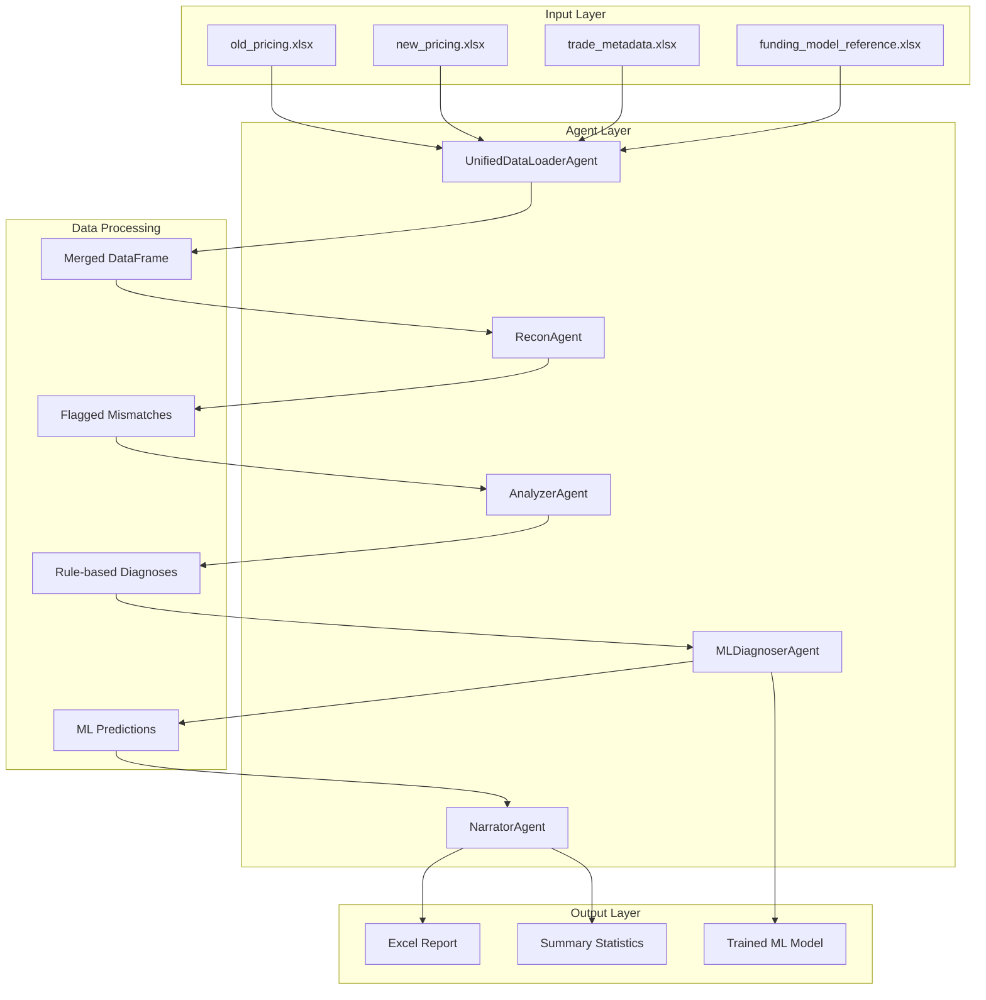
```mermaid
graph TB
    subgraph "Input Layer"
        A[old_pricing.xlsx]
        B[new_pricing.xlsx]
        C[trade_metadata.xlsx]
        D[funding_model_reference.xlsx]
    end
    
    subgraph "Agent Layer"
        E[UnifiedDataLoaderAgent]
        F[ReconAgent]
        G[AnalyzerAgent]
        H[MLDiagnoserAgent]
        I[NarratorAgent]
    end
    
    subgraph "Data Processing"
        J[Merged DataFrame]
        K[Flagged Mismatches]
        L[Rule-based Diagnoses]
        M[ML Predictions]
    end
    
    subgraph "Output Layer"
        N[Excel Report]
        O[Trained ML Model]
        P[Summary Statistics]
    end
    
    A --> E
    B --> E
    C --> E
    D --> E
    E --> J
    J --> F
    F --> K
    K --> G
    G --> L
    L --> H
    H --> M
    M --> I
    I --> N
    I --> P
    H --> O
```

## Data Flow Architecture

### Phase 1: Data Ingestion
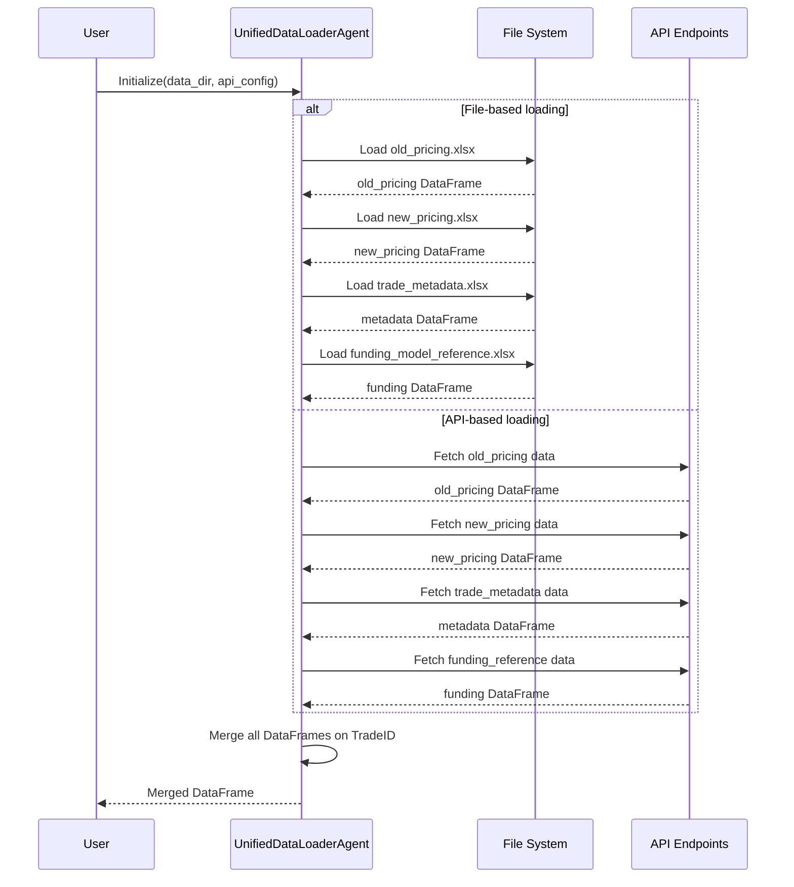
```mermaid
sequenceDiagram
    participant U as User
    participant UDLA as UnifiedDataLoaderAgent
    participant FS as File System
    participant API as API Endpoints
    
    U->>UDLA: Initialize(data_dir, api_config)
    alt File-based loading
        UDLA->>FS: Load old_pricing.xlsx
        FS-->>UDLA: old_pricing DataFrame
        UDLA->>FS: Load new_pricing.xlsx
        FS-->>UDLA: new_pricing DataFrame
        UDLA->>FS: Load trade_metadata.xlsx
        FS-->>UDLA: metadata DataFrame
        UDLA->>FS: Load funding_model_reference.xlsx
        FS-->>UDLA: funding DataFrame
    else API-based loading
        UDLA->>API: Fetch old_pricing data
        API-->>UDLA: old_pricing DataFrame
        UDLA->>API: Fetch new_pricing data
        API-->>UDLA: new_pricing DataFrame
        UDLA->>API: Fetch trade_metadata data
        API-->>UDLA: metadata DataFrame
        UDLA->>API: Fetch funding_reference data
        API-->>UDLA: funding DataFrame
    end
    UDLA->>UDLA: Merge all DataFrames on TradeID
    UDLA-->>U: Merged DataFrame
```

### Phase 2: Mismatch Detection
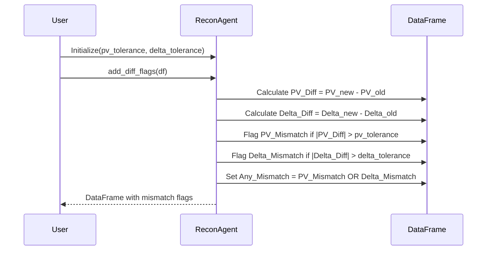
```mermaid
sequenceDiagram
    participant U as User
    participant RA as ReconAgent
    participant DF as DataFrame
    
    U->>RA: Initialize(pv_tolerance, delta_tolerance)
    U->>RA: add_diff_flags(df)
    RA->>DF: Calculate PV_Diff = PV_new - PV_old
    RA->>DF: Calculate Delta_Diff = Delta_new - Delta_old
    RA->>DF: Flag PV_Mismatch if |PV_Diff| > pv_tolerance
    RA->>DF: Flag Delta_Mismatch if |Delta_Diff| > delta_tolerance
    RA->>DF: Set Any_Mismatch = PV_Mismatch OR Delta_Mismatch
    RA-->>U: DataFrame with mismatch flags
```

### Phase 3: Analysis & Prediction
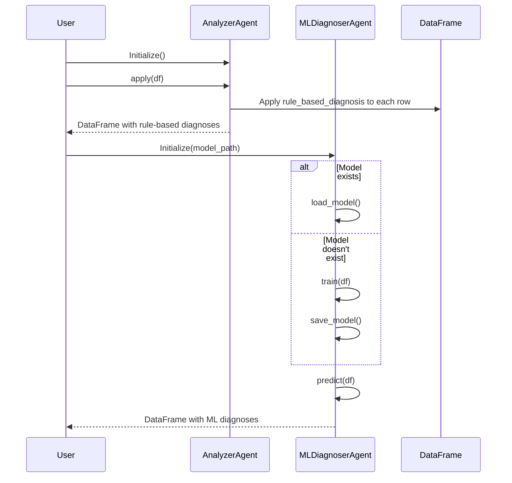
```mermaid
sequenceDiagram
    participant U as User
    participant AA as AnalyzerAgent
    participant MLA as MLDiagnoserAgent
    participant DF as DataFrame
    
    U->>AA: Initialize()
    U->>AA: apply(df)
    AA->>DF: Apply rule_based_diagnosis to each row
    AA-->>U: DataFrame with rule-based diagnoses
    
    U->>MLA: Initialize(model_path)
    alt Model exists
        MLA->>MLA: load_model()
    else Model doesn't exist
        MLA->>MLA: train(df)
        MLA->>MLA: save_model()
    end
    MLA->>MLA: predict(df)
    MLA-->>U: DataFrame with ML diagnoses
```

### Phase 4: Report Generation
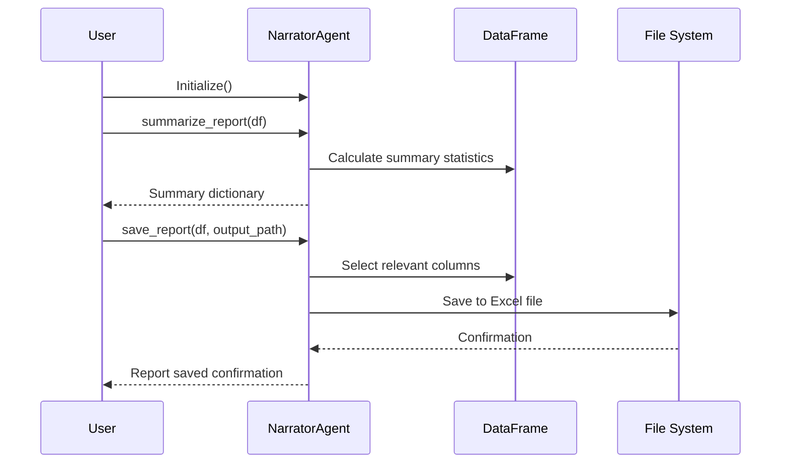
```mermaid
sequenceDiagram
    participant U as User
    participant NA as NarratorAgent
    participant DF as DataFrame
    participant FS as File System
    
    U->>NA: Initialize()
    U->>NA: summarize_report(df)
    NA->>DF: Calculate summary statistics
    NA-->>U: Summary dictionary
    
    U->>NA: save_report(df, output_path)
    NA->>DF: Select relevant columns
    NA->>FS: Save to Excel file
    FS-->>NA: Confirmation
    NA-->>U: Report saved confirmation
```

## Component Interaction Diagram

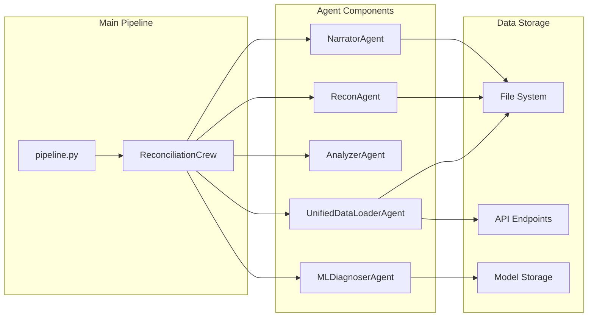
```mermaid
graph LR
    subgraph "Main Pipeline"
        P[pipeline.py]
        C[ReconciliationCrew]
    end
    
    subgraph "Agent Components"
        UDLA[UnifiedDataLoaderAgent]
        RA[ReconAgent]
        AA[AnalyzerAgent]
        MLA[MLDiagnoserAgent]
        NA[NarratorAgent]
    end
    
    subgraph "Data Storage"
        FS[File System]
        API[API Endpoints]
        M[Model Storage]
    end
    
    P --> C
    C --> UDLA
    C --> RA
    C --> AA
    C --> MLA
    C --> NA
    
    UDLA --> FS
    UDLA --> API
    RA --> FS
    NA --> FS
    MLA --> M
```

## ML Model Architecture

### Training Pipeline
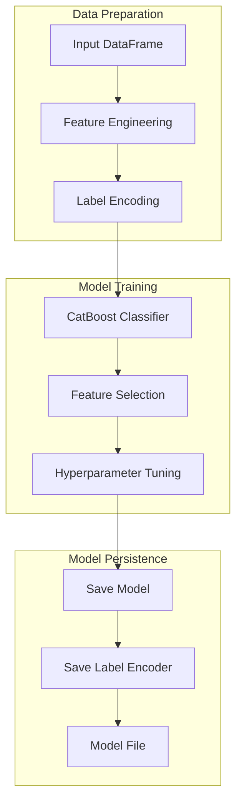
```mermaid
graph TD
    subgraph "Data Preparation"
        A[Input DataFrame]
        B[Feature Engineering]
        C[Label Encoding]
    end
    
    subgraph "Model Training"
        D[CatBoost Classifier]
        E[Feature Selection]
        F[Hyperparameter Tuning]
    end
    
    subgraph "Model Persistence"
        G[Save Model]
        H[Save Label Encoder]
        I[Model File]
    end
    
    A --> B
    B --> C
    C --> D
    D --> E
    E --> F
    F --> G
    G --> H
    H --> I
```

### Prediction Pipeline
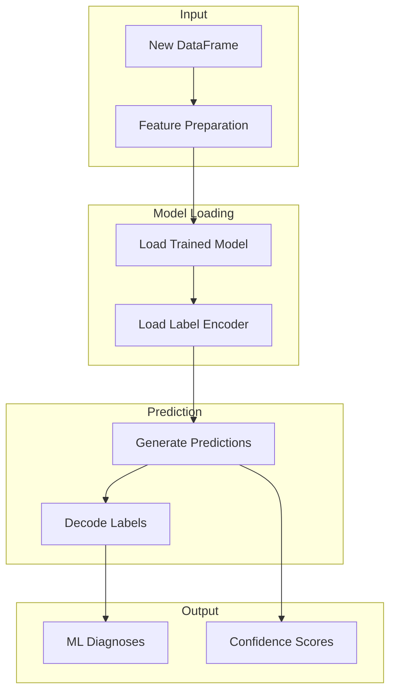
```mermaid
graph TD
    subgraph "Input"
        A[New DataFrame]
        B[Feature Preparation]
    end
    
    subgraph "Model Loading"
        C[Load Trained Model]
        D[Load Label Encoder]
    end
    
    subgraph "Prediction"
        E[Generate Predictions]
        F[Decode Labels]
    end
    
    subgraph "Output"
        G[ML Diagnoses]
        H[Confidence Scores]
    end
    
    A --> B
    B --> C
    C --> D
    D --> E
    E --> F
    F --> G
    E --> H
```

## Data Schema Diagram

### Input Data Structure
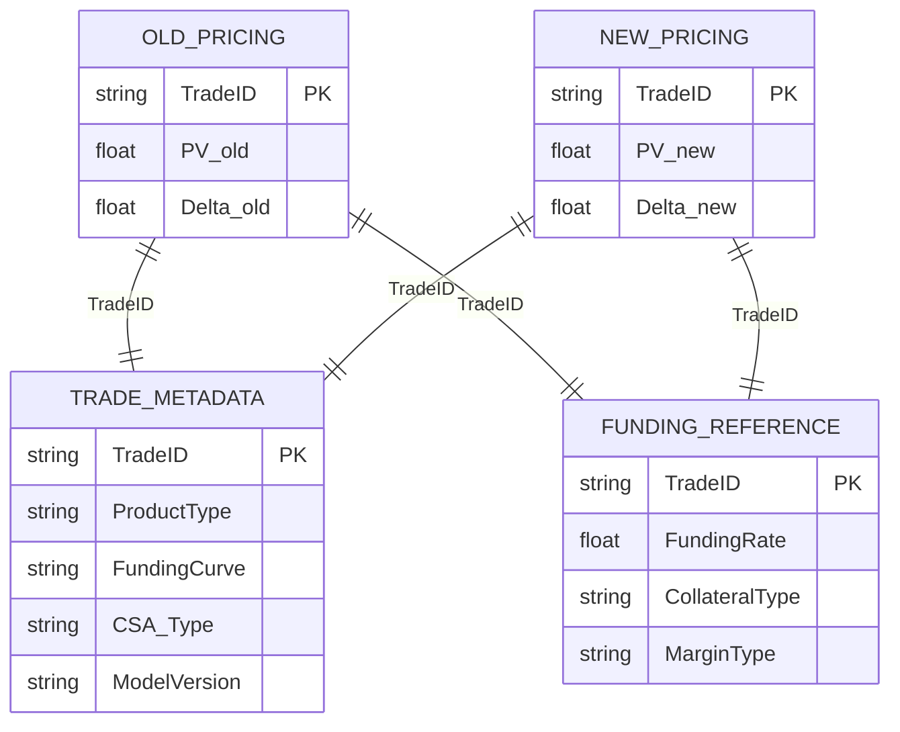
```mermaid
erDiagram
    OLD_PRICING {
        string TradeID PK
        float PV_old
        float Delta_old
    }
    
    NEW_PRICING {
        string TradeID PK
        float PV_new
        float Delta_new
    }
    
    TRADE_METADATA {
        string TradeID PK
        string ProductType
        string FundingCurve
        string CSA_Type
        string ModelVersion
    }
    
    FUNDING_REFERENCE {
        string TradeID PK
        float FundingRate
        string CollateralType
        string MarginType
    }
    
    OLD_PRICING ||--|| TRADE_METADATA : TradeID
    NEW_PRICING ||--|| TRADE_METADATA : TradeID
    OLD_PRICING ||--|| FUNDING_REFERENCE : TradeID
    NEW_PRICING ||--|| FUNDING_REFERENCE : TradeID
```

### Output Data Structure
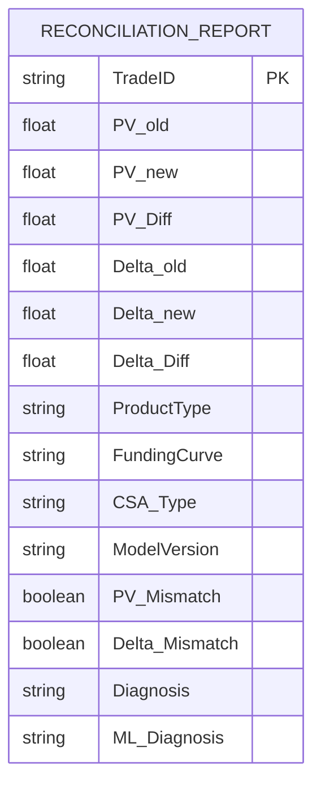
```mermaid
erDiagram
    RECONCILIATION_REPORT {
        string TradeID PK
        float PV_old
        float PV_new
        float PV_Diff
        float Delta_old
        float Delta_new
        float Delta_Diff
        string ProductType
        string FundingCurve
        string CSA_Type
        string ModelVersion
        boolean PV_Mismatch
        boolean Delta_Mismatch
        string Diagnosis
        string ML_Diagnosis
    }
```

## Process Flow Diagram

### Complete Workflow
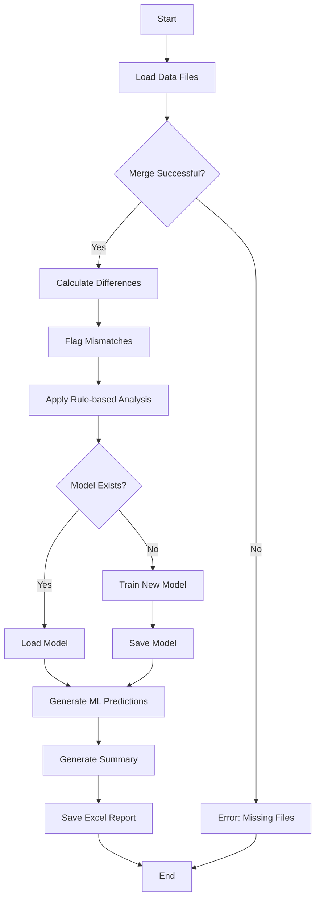
```mermaid
flowchart TD
    A[Start] --> B[Load Data Files]
    B --> C{Merge Successful?}
    C -->|Yes| D[Calculate Differences]
    C -->|No| E[Error: Missing Files]
    D --> F[Flag Mismatches]
    F --> G[Apply Rule-based Analysis]
    G --> H{Model Exists?}
    H -->|Yes| I[Load Model]
    H -->|No| J[Train New Model]
    J --> K[Save Model]
    I --> L[Generate ML Predictions]
    K --> L
    L --> M[Generate Summary]
    M --> N[Save Excel Report]
    N --> O[End]
    E --> O
```

### Error Handling Flow
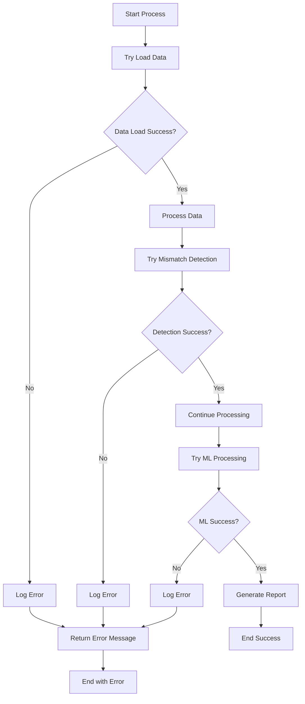
```mermaid
flowchart TD
    A[Start Process] --> B[Try Load Data]
    B --> C{Data Load Success?}
    C -->|Yes| D[Process Data]
    C -->|No| E[Log Error]
    E --> F[Return Error Message]
    D --> G[Try Mismatch Detection]
    G --> H{Detection Success?}
    H -->|Yes| I[Continue Processing]
    H -->|No| J[Log Error]
    J --> F
    I --> K[Try ML Processing]
    K --> L{ML Success?}
    L -->|Yes| M[Generate Report]
    L -->|No| N[Log Error]
    N --> F
    M --> O[End Success]
    F --> P[End with Error]
```

## Performance Monitoring Diagram

### System Performance Metrics
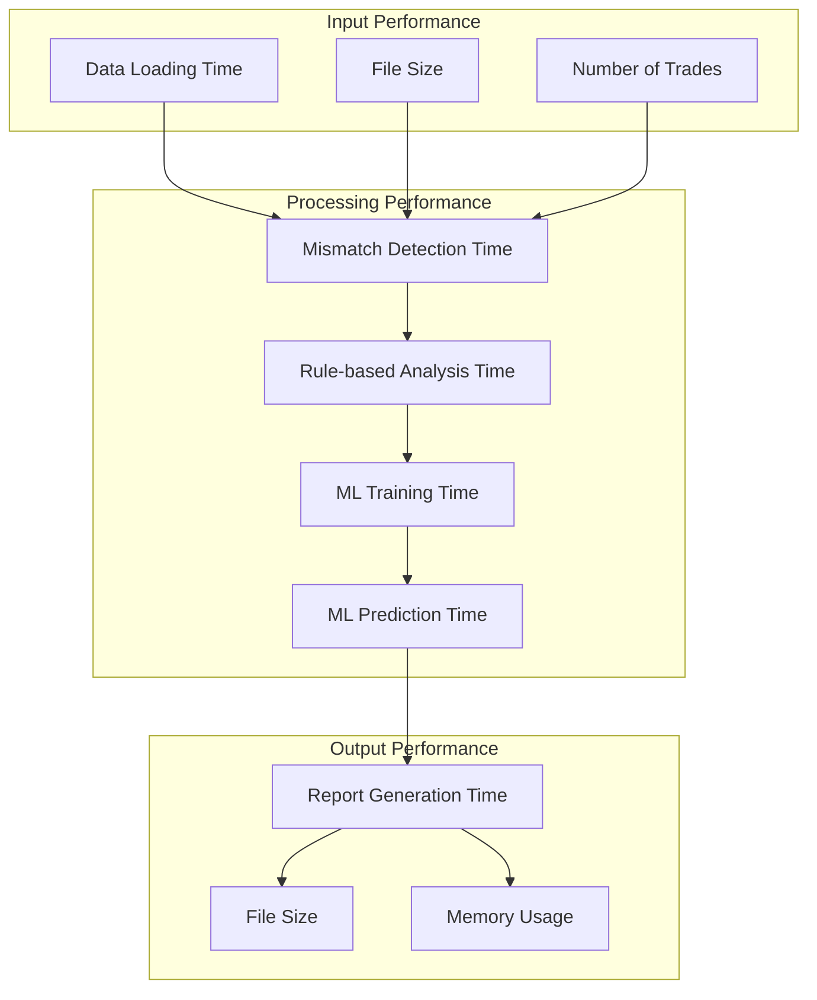
```mermaid
graph TD
    subgraph "Input Performance"
        A[Data Loading Time]
        B[File Size]
        C[Number of Trades]
    end
    
    subgraph "Processing Performance"
        D[Mismatch Detection Time]
        E[Rule-based Analysis Time]
        F[ML Training Time]
        G[ML Prediction Time]
    end
    
    subgraph "Output Performance"
        H[Report Generation Time]
        I[File Size]
        J[Memory Usage]
    end
    
    A --> D
    B --> D
    C --> D
    D --> E
    E --> F
    F --> G
    G --> H
    H --> I
    H --> J
```

## Deployment Architecture

### Local Deployment
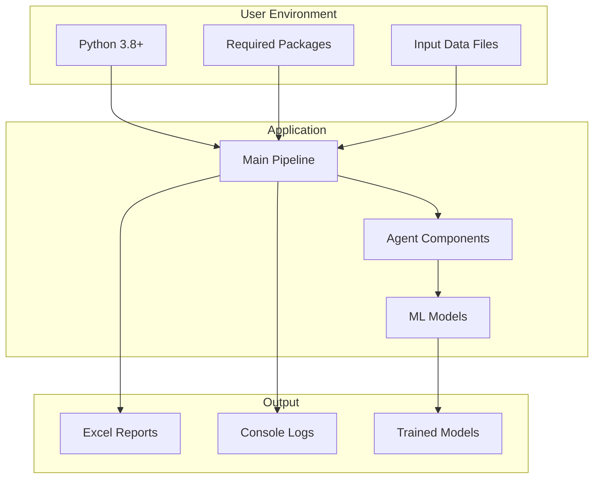
```mermaid
graph TB
    subgraph "User Environment"
        A[Python 3.8+]
        B[Required Packages]
        C[Input Data Files]
    end
    
    subgraph "Application"
        D[Main Pipeline]
        E[Agent Components]
        F[ML Models]
    end
    
    subgraph "Output"
        G[Excel Reports]
        H[Console Logs]
        I[Trained Models]
    end
    
    A --> D
    B --> D
    C --> D
    D --> E
    E --> F
    D --> G
    D --> H
    F --> I
```

### Future Cloud Deployment
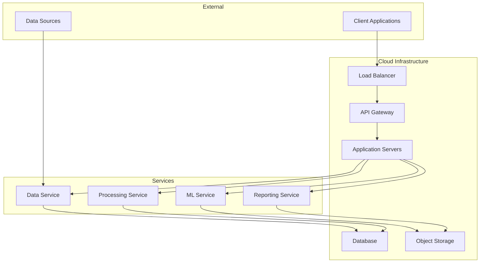
```mermaid
graph TB
    subgraph "Cloud Infrastructure"
        A[Load Balancer]
        B[API Gateway]
        C[Application Servers]
        D[Database]
        E[Object Storage]
    end
    
    subgraph "Services"
        F[Data Service]
        G[Processing Service]
        H[ML Service]
        I[Reporting Service]
    end
    
    subgraph "External"
        J[Client Applications]
        K[Data Sources]
    end
    
    J --> A
    A --> B
    B --> C
    C --> F
    C --> G
    C --> H
    C --> I
    F --> D
    G --> D
    H --> E
    I --> E
    K --> F
```

## Security Architecture

### Data Security Flow
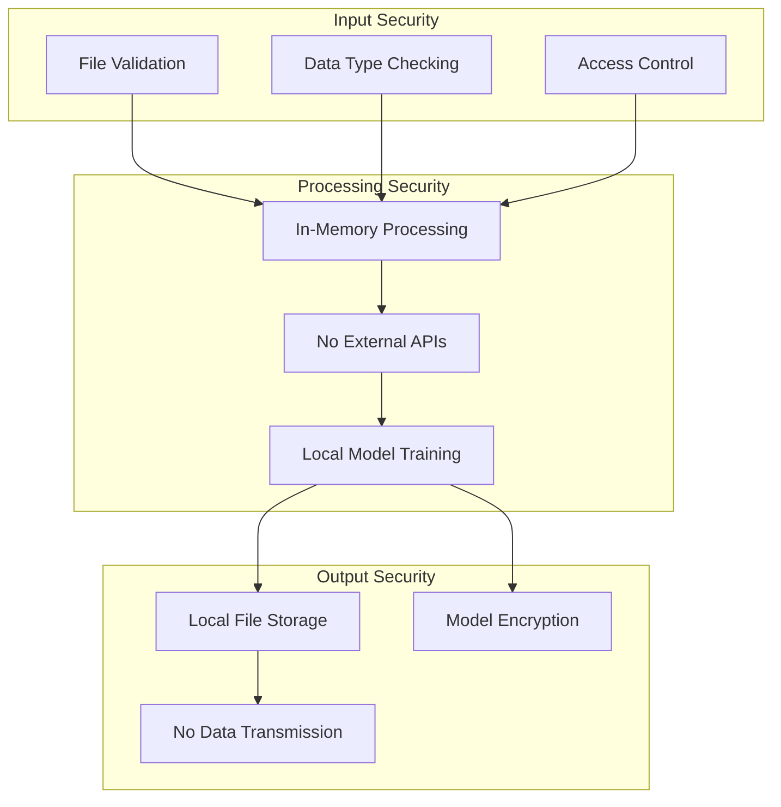
```mermaid
graph TD
    subgraph "Input Security"
        A[File Validation]
        B[Data Type Checking]
        C[Access Control]
    end
    
    subgraph "Processing Security"
        D[In-Memory Processing]
        E[No External APIs]
        F[Local Model Training]
    end
    
    subgraph "Output Security"
        G[Local File Storage]
        H[No Data Transmission]
        I[Model Encryption]
    end
    
    A --> D
    B --> D
    C --> D
    D --> E
    E --> F
    F --> G
    G --> H
    F --> I
```

## Monitoring and Alerting

### System Monitoring
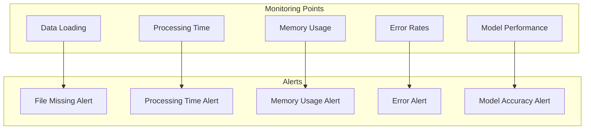
```mermaid
graph TD
    subgraph "Monitoring Points"
        A[Data Loading]
        B[Processing Time]
        C[Memory Usage]
        D[Error Rates]
        E[Model Performance]
    end
    
    subgraph "Alerts"
        F[File Missing Alert]
        G[Processing Time Alert]
        H[Memory Usage Alert]
        I[Error Alert]
        J[Model Accuracy Alert]
    end
    
    A --> F
    B --> G
    C --> H
    D --> I
    E --> J
```

## Integration Architecture

### External System Integration
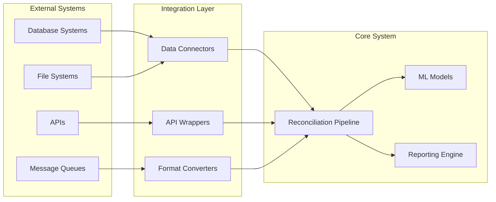
```mermaid
graph LR
    subgraph "External Systems"
        A[Database Systems]
        B[File Systems]
        C[APIs]
        D[Message Queues]
    end
    
    subgraph "Integration Layer"
        E[Data Connectors]
        F[API Wrappers]
        G[Format Converters]
    end
    
    subgraph "Core System"
        H[Reconciliation Pipeline]
        I[ML Models]
        J[Reporting Engine]
    end
    
    A --> E
    B --> E
    C --> F
    D --> G
    E --> H
    F --> H
    G --> H
    H --> I
    H --> J
```

## Scalability Architecture

### Horizontal Scaling
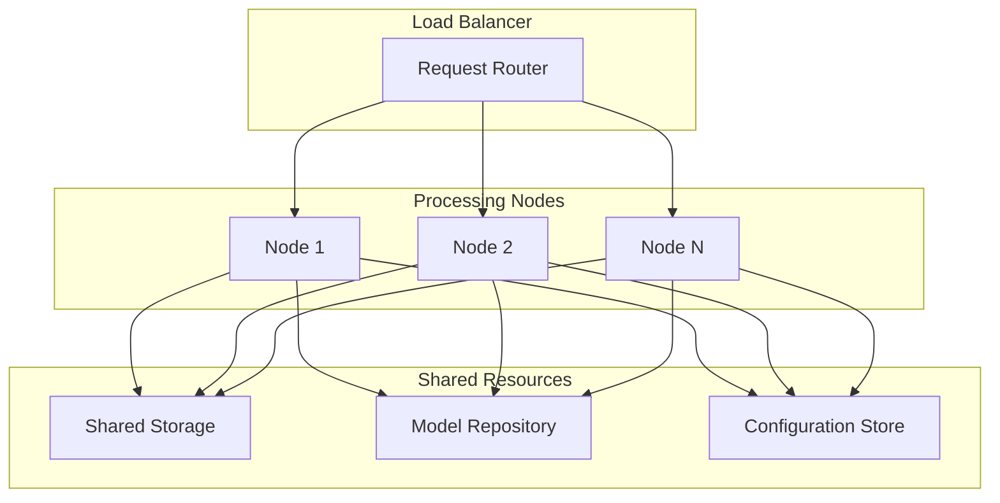
```mermaid
graph TD
    subgraph "Load Balancer"
        A[Request Router]
    end
    
    subgraph "Processing Nodes"
        B[Node 1]
        C[Node 2]
        D[Node N]
    end
    
    subgraph "Shared Resources"
        E[Shared Storage]
        F[Model Repository]
        G[Configuration Store]
    end
    
    A --> B
    A --> C
    A --> D
    B --> E
    C --> E
    D --> E
    B --> F
    C --> F
    D --> F
    B --> G
    C --> G
    D --> G
```

## Future Enhancement Architecture

### Real-time Processing
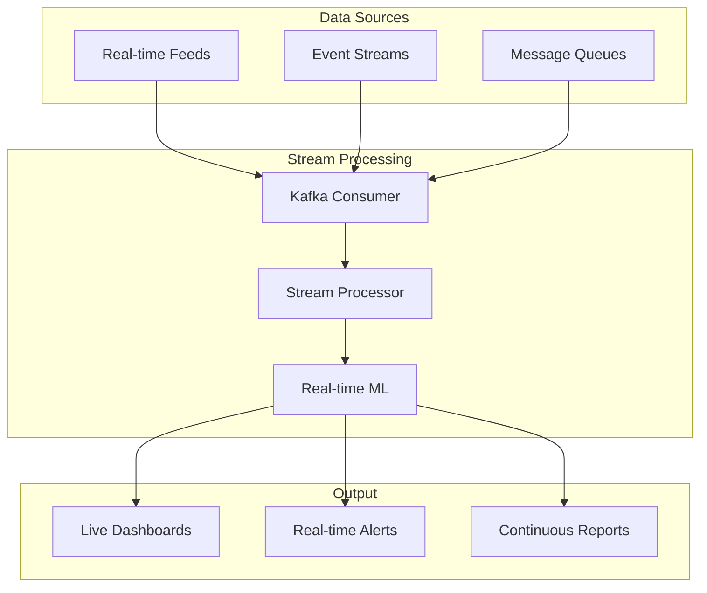
```mermaid
graph TD
    subgraph "Data Sources"
        A[Real-time Feeds]
        B[Event Streams]
        C[Message Queues]
    end
    
    subgraph "Stream Processing"
        D[Kafka Consumer]
        E[Stream Processor]
        F[Real-time ML]
    end
    
    subgraph "Output"
        G[Live Dashboards]
        H[Real-time Alerts]
        I[Continuous Reports]
    end
    
    A --> D
    B --> D
    C --> D
    D --> E
    E --> F
    F --> G
    F --> H
    F --> I
```

### Advanced ML Pipeline
```mermaid
graph TD
    subgraph "Data Pipeline"
        A[Feature Engineering]
        B[Data Validation]
        C[Data Augmentation]
    end
    
    subgraph "Model Pipeline"
        D[Model Selection]
        E[Hyperparameter Tuning]
        F[Ensemble Methods]
    end
    
    subgraph "Deployment"
        G[Model Versioning]
        H[A/B Testing]
        I[Performance Monitoring]
    end
    
    A --> D
    B --> D
    C --> D
    D --> E
    E --> F
    F --> G
    G --> H
    H --> I
``` 