# 📊 System Diagrams

## Overview

This document contains comprehensive diagrams for the AI-Powered Reconciliation System, including architecture, data flow, and component interactions, featuring the **dynamic label generation system**.

## System Architecture Diagram


## Dynamic Label Generation Architecture

### Core Components


### Business Rules Engine


### Pattern Discovery Process


## Data Flow Architecture

### Phase 1: Data Ingestion


### Phase 2: Mismatch Detection


### Phase 3: Dynamic Analysis & Prediction


### Phase 4: Report Generation


## Business Rules Flow

### PV Rule Application


### Delta Rule Application

```mermaid
graph TD
    A[Start Delta Analysis] --> B{ProductType == 'Option' and Delta_Mismatch == True?}
    B -->|Yes| C[Label: Vol sensitivity likely – delta impact]
    B -->|No| D{Delta_Mismatch == False?}
    D -->|Yes| E[Label: Within tolerance]
    D -->|No| F[Label: Default diagnosis]
    
    C --> G[End]
    E --> G
    F --> G
```


## Pattern Discovery Flow

### PV Pattern Discovery


### Delta Pattern Discovery


## ML Model Integration

### Training with Dynamic Labels


### Prediction with Dynamic Labels


## Domain Knowledge Categories

### Trade Lifecycle Patterns


### Curve/Model Patterns


### Funding/CSA Patterns


### Volatility Patterns


## Configuration Management

### Business Rules Configuration


### Pattern Discovery Configuration


## Error Handling Flow

### Dynamic Label Generation Errors
```mermaid
graph TD
    A[Generate Labels] --> B{Business rules valid?}
    B -->|No| C[Log error: Invalid business rules]
    B -->|Yes| D{Pattern discovery successful?}
    D -->|No| E[Log error: Pattern discovery failed]
    D -->|Yes| F{Label generation successful?}
    F -->|No| G[Log error: Label generation failed]
    F -->|Yes| H[Return generated labels]
    
    C --> I[Use fallback labels]
    E --> I
    G --> I
    I --> J[End with fallback]
    H --> K[End successfully]
```

### Business Rule Evaluation Errors
```mermaid
graph TD
    A[Evaluate Condition] --> B{Parse condition safely?}
    B -->|No| C[Log error: Invalid condition syntax]
    B -->|Yes| D{Evaluate condition successfully?}
    D -->|No| E[Log error: Condition evaluation failed]
    D -->|Yes| F[Return evaluation result]
    
    C --> G[Use default evaluation]
    E --> G
    G --> H[End with default]
    F --> I[End successfully]
```

## Performance Monitoring

### System Performance Metrics
```mermaid
graph TD
    A[Monitor Performance] --> B[Track processing time]
    B --> C[Monitor memory usage]
    C --> D[Track pattern discovery rate]
    D --> E[Monitor label generation speed]
    E --> F[Track ML model performance]
    F --> G[Generate performance report]
    G --> H[End monitoring]
```

### Dynamic Label Performance
```mermaid
graph TD
    A[Monitor Dynamic Labels] --> B[Track label generation time]
    B --> C[Monitor pattern discovery rate]
    C --> D[Track business rule application]
    D --> E[Monitor historical learning]
    E --> F[Track label diversity]
    F --> G[Generate label statistics]
    G --> H[End monitoring]
```

## Integration Examples

### Complete Workflow Integration
```mermaid
graph TD
    A[Start Workflow] --> B[Load Data]
    B --> C[Detect Mismatches]
    C --> D[Apply Dynamic Analysis]
    D --> E[Generate Dynamic Labels]
    E --> F[Train ML Model]
    F --> G[Make Predictions]
    G --> H[Generate Report]
    H --> I[End Workflow]
```

### Custom Business Rules Integration
```mermaid
graph TD
    A[Add Custom Rule] --> B[Validate rule syntax]
    B --> C[Add to business rules]
    C --> D[Update analyzer agent]
    D --> E[Test rule application]
    E --> F[Deploy rule]
    F --> G[Monitor rule performance]
    G --> H[End integration]
```

### ML Model Integration
```mermaid
graph TD
    A[Initialize ML Agent] --> B[Load dynamic labels]
    B --> C[Prepare features]
    C --> D[Train model]
    D --> E[Make predictions]
    E --> F[Update label generator]
    F --> G[Save model]
    G --> H[End integration]
```

## Future Enhancements

### Advanced Pattern Recognition
```mermaid
graph TD
    A[Advanced Patterns] --> B[ML-based pattern discovery]
    B --> C[Deep learning integration]
    C --> D[Ensemble methods]
    D --> E[Real-time pattern recognition]
    E --> F[End enhancement]
```

### Real-time Streaming
```mermaid
graph TD
    A[Real-time Processing] --> B[Stream data ingestion]
    B --> C[Real-time analysis]
    C --> D[Live pattern discovery]
    D --> E[Instant label generation]
    E --> F[End enhancement]
```

### Advanced Analytics
```mermaid
graph TD
    A[Advanced Analytics] --> B[Statistical analysis]
    B --> C[Trend detection]
    C --> D[Anomaly detection]
    D --> E[Predictive analytics]
    E --> F[End enhancement]
``` 